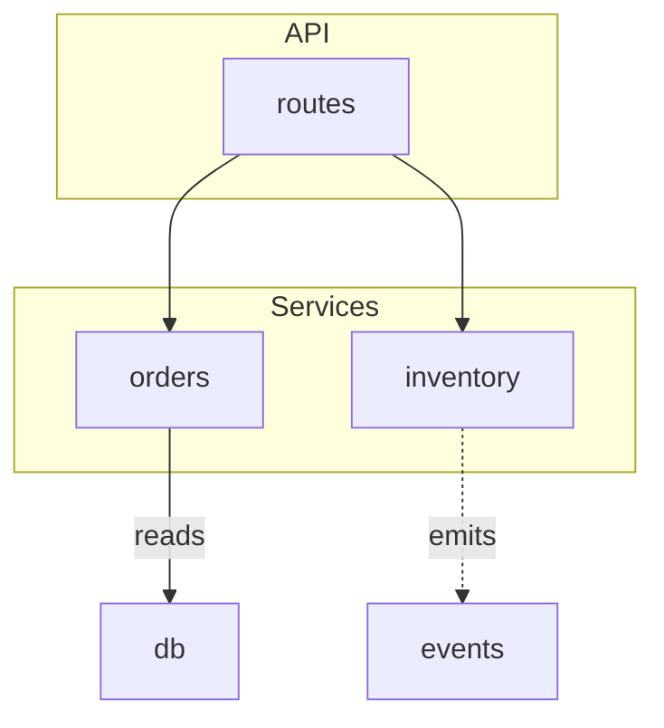
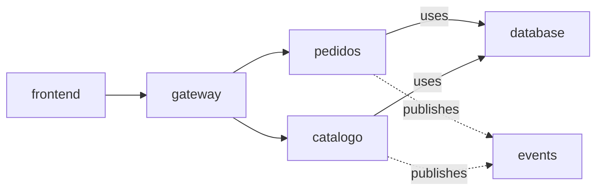
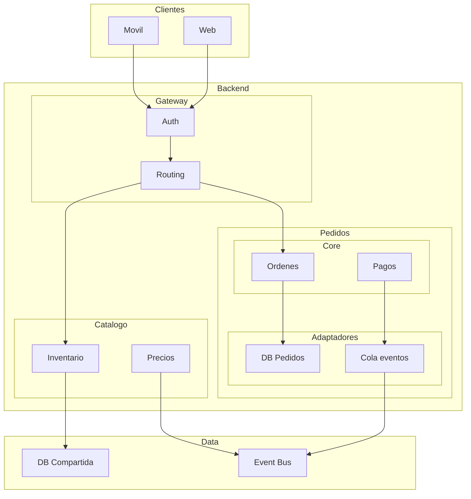
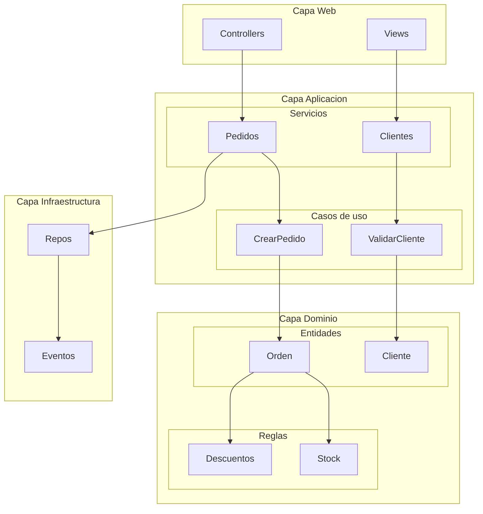
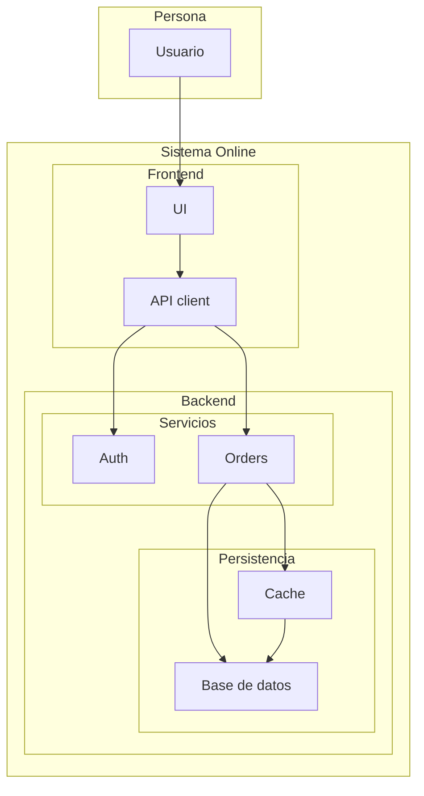

# EXAMPLES — Before / after

## Example 1: Scan → diagram (Python project)

**What the agent found** (from grep/glob over the repo):

- `app/api/` imports `app/services/orders.py` and `app/services/inventory.py`
- `app/services/inventory.py` emits events to `app/events/`
- `app/services/orders.py` reads from `app/db.py`

**Mermaid output (default):**



**PlantUML output (on request):**

```plantuml
@startuml
component "API" {
  component "routes"
}
component "Services" {
  component "orders"
  component "inventory"
}
component "events"
db
routes --> orders
routes --> inventory
orders --> db : reads
inventory ..> events : emits
@enduml
```

## Example 2: Render → diagram (user-described microservices)

**User said:** *"El frontend llama al gateway; el gateway enruta a pedidos y catálogo; ambos usan la misma base de datos y publican eventos."*

**Output:**



**Notes**

- Module names kept verbatim (`pedidos`, `catalogo`).
- Layers not requested → no subgraphs, flat flow.
- `db` shared → rendered once, referenced twice (never duplicated).

## Example 3: Rendering the output with mermaid-cli

After writing the `.md`, the agent renders a preview:

1. Extract the Mermaid block from Example 1 into `/tmp/diagrama.mmd`.
2. Render to SVG:
   ```bash
   npx -p @mermaid-js/mermaid-cli mmdc -i /tmp/diagrama.mmd -o /tmp/diagrama.svg
   ```
3. Tell the user where the preview is: `SVG listo en /tmp/diagrama.svg`.

For a multi-diagram `.md`, render all blocks at once and get embedded SVGs:

```bash
npx -p @mermaid-js/mermaid-cli mmdc -i arch.template.md -o arch.md
# genera arch-1.svg, arch-2.svg… y los embebe en arch.md
```

If the render fails (no network), keep the `.md` and note that it renders on GitHub/Obsidian/mermaid.live.

## Example 4: Live view with zoom + folding

1. Write the Example 1 diagram source to `diagrama.mmd` in the project.
2. Serve it:
   ```bash
   bash ~/.config/opencode/skills/from-mattpocock/engineering/architecture-viewer/scripts/serve-viewer.sh diagrama.mmd
   ```
3. Browser opens `/?src=diagrama.mmd`. Now:
   - **Zoom**: scroll wheel, `+`/`−`; `Reset`/`0` encuadra y centra todo el diagrama (fit-to-view); drag to pan.
   - **Zoom-to-fit**: click the *body* de un subgraph (el rectángulo, cursor `zoom-in`) → se amplía y centra ese subgraph.
   - **Fold**: click la *etiqueta* de `API`/`Services`/`Infrastructure` para colapsar/expandir esa capa.
   - **Tema**: el botón de tema (sol/luna) conmuta claro/oscuro; Mermaid se re-renderiza para coincidir.
   - **Live edit**: change the `.mmd` → page auto-reloads with the new diagram.
4. `serve-viewer.sh` copied `viewer.html`, `mermaid.min.js`, `panzoom.min.js`, `daisyui.css` y `tailwind-browser.js` next to `diagrama.mmd` — no network needed after that.

## Example 5: Nested subgraphs (multi-level folding)

Serve any of these with `?src=<archivo>.mmd` to test folding and zoom-to-fit across nesting levels:

**`nested-micro.mmd`** — microservices, 3 levels (`Backend > Pedidos > Core/Adapters`):



**`nested-layers.mmd`** — layered monolith (`Aplicación > Servicios/Casos`, `Dominio > Entidades/Reglas`):



**`nested-c4.mmd`** — C4-style (`Sistema > Frontend/Backend > Servicios/Persistencia`):



**Expected interactions on nested diagrams:**

- Fold `Pedidos` (level 2) → the diagram **reflows**: `Pedidos` becomes the stub node `Pedidos (4)` and the parent `Backend` box shrinks (no empty space).
- Fold `Backend` (level 1) → stub `Backend (8)`; only `Clientes` and `Data` remain.
- Click the *body* of a deep cluster (e.g. `Core`) → zoom-to-fit centers it.
- `Expand all` restores everything; `Collapse all` collapses the top-level clusters (`Clientes (2)`, `Backend (8)`, `Data (2)`).
- Fold state survives theme toggles (the stub is re-generated).

**Convention:** node ids must match the SVG ids (use simple `[A-Za-z0-9_]` ids); define edges outside the subgraphs so membership parsing stays exact.