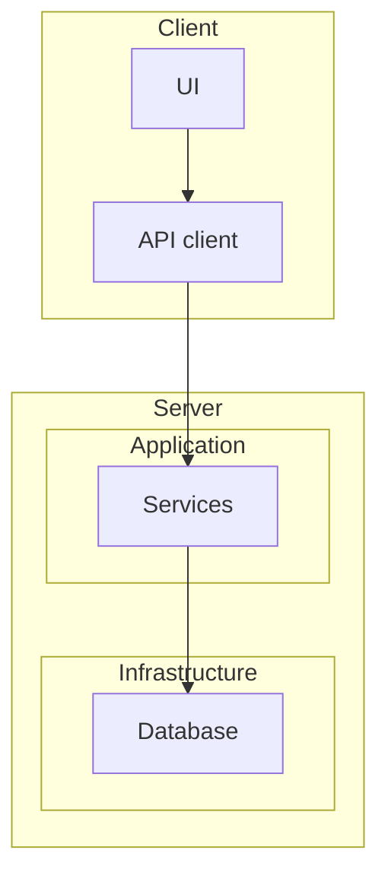
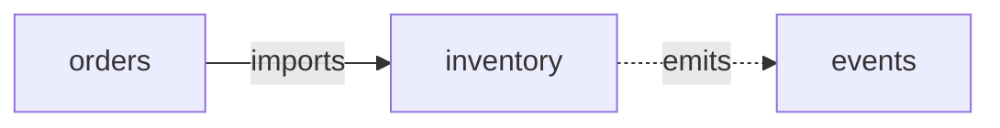
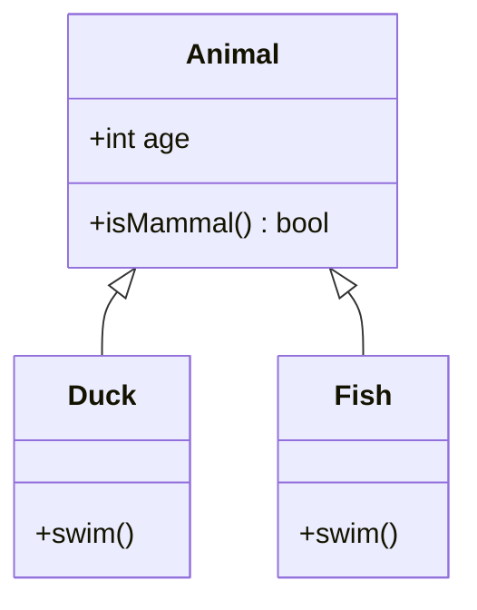
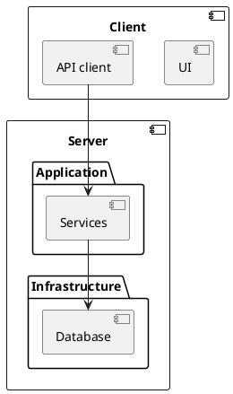
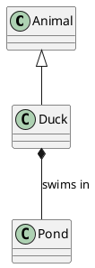

# REFERENCE — Diagram syntax and patterns

## Mermaid

### Flowchart with nested subgraphs (module structure)



### Relationship arrows

| Arrow | Meaning | Example |
|---|---|---|
| `-->` | depends on / calls | `orders --> inventory` |
| `-.->` | indirect / async | `web -.-> events` |
| `o--` | uses (optional) | `cache o-- config` |
| `-- label -->` | labeled dependency | `auth -- "validates" --> token` |

### Labeled arrows (dependency verbs)



### classDiagram (classes & inheritance)



## PlantUML

### Nested packages (component/package view)



### Nested namespaces with rectangle

```plantuml
@startuml
namespace client {
  rectangle "ui"
  rectangle "api"
}
namespace server {
  rectangle "services"
  rectangle "db"
}
client.api --> server.services
server.services --> server.db
@enduml
```

### Relationships (UML semantics)

| Symbol | Meaning |
|---|---|
| `A --|> B` | B is a base class of A (inheritance) |
| `A *-- B` | Composition (B is part of A) |
| `A o-- B` | Aggregation (B is contained, shared) |
| `A --> B` | Dependency / association |
| `A ..> B` | Dependency (usage) |



## Rendering (mermaid-cli)

Uses `@mermaid-js/mermaid-cli` via npx (no global install). Requires network on first run (downloads Chromium once).

### Single diagram

Extract the Mermaid block to `diagrama.mmd` and render — output format follows the extension:

```bash
npx -p @mermaid-js/mermaid-cli mmdc -i diagrama.mmd -o diagrama.svg   # or .png / .pdf
```

### Whole markdown file (multi-diagram)

`mmdc` finds every `mermaid` code block, renders each to `arch-1.svg`, `arch-2.svg`… and embeds them:

```bash
npx -p @mermaid-js/mermaid-cli mmdc -i arch.template.md -o arch.md
```

### Common options

| Flag | Effect |
|---|---|
| `-t dark` | Dark theme |
| `-b transparent` | Transparent background (PNG) |
| `-w` / `-H` | Width / height |
| `-c puppeteer-config.json` | Custom puppeteer/Chrome config |
| `--input -` | Read diagram from stdin |

### Troubleshooting

- **`Could not find chrome-headless-shell`**: install the browser once, then retry:
  ```bash
  npx -y puppeteer browsers install chrome-headless-shell
  ```
- **Linux sandbox error** (Chrome headless): pass a puppeteer config with `{"args": ["--no-sandbox"]}` via `-c`.
- **Offline / render fails**: skip rendering, keep the `.md`, tell the user to open it on GitHub/Obsidian/mermaid.live.
- **Docker fallback**: `docker run --rm -v $PWD:/data minlag/mermaid-cli -i diagrama.mmd -o diagrama.svg`.

## Live viewer (interactive)

Interactive hot-reload view with zoom + subgraph folding. Bundled in the skill (works offline).

### Start

```bash
bash scripts/serve-viewer.sh path/to/diagrama.mmd
```

Copies `viewer.html`, `mermaid.min.js`, `panzoom.min.js`, `daisyui.css` and `tailwind-browser.js` next to the diagram, starts `live-server` on the directory and opens the default browser at `/?src=diagrama.mmd`.

### How it works

- **Source**: the diagram is fetched via `?src=<file>.mmd`. If no param, it defaults to `diagrama.mmd`. Render it with a custom `fetch` + `mermaid.render()` so editing the `.mmd` + hot-reload shows changes live.
- **UI (DaisyUI)**: toolbar with `btn btn-circle` icon buttons (zoom in/out, reset, expand/collapse all, theme toggle) and `tooltip` hints. Light/dark themes via `data-theme` on `<html>`; the choice is persisted in `localStorage` and defaults to `prefers-color-scheme`. Changing theme re-renders the diagram with a matching Mermaid theme (`theme: 'dark'` / `'default'`, transparent background).
- **Centering**: `#stage` is a flex container (`align-items/justify-content: center`) and the SVG gets an explicit pixel width after render, so the diagram is centered on both axes at load and after `Reset` (`panzoom.reset()` returns to `scale(1) translate(0,0)`).
- **Zoom/pan**: `@panzoom/panzoom` — mouse wheel or `+`/`-`, `0` resets, drag to pan. Wheel is wired manually via `svg.addEventListener('wheel', panzoomInstance.zoomWithWheel)`.
- **Folding (reflow)**: clicking a `g.cluster-label` toggles the subgraph in the `collapsed` set and **re-generates the Mermaid source** (`generateSource()`): a collapsed subgraph becomes a stub node `Label (n)` (n = transitive node count), its edges are rewritten to point at the stub (`rewriteLine`/`rewriteEndpoint`, using the `ownerCluster`/`parentOf` maps), and the diagram is re-rendered — so the layout genuinely compresses. A collapsed cluster is represented by a `g.node.stub-node`; clicking it expands. Toolbar `Expand all` / `Collapse all` collapse only top-level clusters.
- **Fit to view**: `fitToView()` frames the whole diagram (scale `min(1, min(stageW/W, stageH/H) * 0.9)`, centered). Applied on initial load, the `Reset` button, the `0` key, and after `Expand all` / `Collapse all`. It uses a deterministic transform (`screen = L + O + (local + pan − O) × scale`, where `L` is the flex laid-out origin and `O` the SVG's transform-origin = element center — panzoom uses `transform-origin: center`, not `0 0`).
- **Zoom-to-fit (focus)**: click on the subgraph **body rect** (`g.cluster > rect`) zooms and centers that subgraph. `focusCluster()` computes the target scale from the cluster's screen bbox and applies the same deterministic transform math, then `zoom(S)` + `pan(u, v, {relative:false})` (panzoom's `pan` delta is in local units: a screen delta must be divided by the scale — hence the formulas above).
- **State**: `collapsed` persists across re-renders and theme toggles (theme re-render also regenerates with the set).
- **Viewport preservation**: `renderDiagram` captures `getScale()`/`getPan()` before re-rendering and restores them after (`zoom(prevScale)` + `pan(prevX, prevY, {relative:false})`), so collapsing/expanding/theming keeps the same zoom level and anchor instead of jumping back to `scale(1)`. A ~180ms WAAPI opacity fade masks the layout reflow (it doesn't touch CSS `transition`, so panzoom is unaffected).
- **Click vs drag**: a drag detector listens for `pointerdown`/`pointermove`/`pointerup` at `document` capture phase (Chromium suppresses mouse events during panzoom drags because of `touch-action: none`). If the pointer moved more than 5px, a capture-phase `click` listener calls `stopImmediatePropagation()` so dragging never triggers fold/zoom actions; a clean click still does.

### Caveats

- Fold/zoom hooks into Mermaid `flowchart` `g.cluster` elements — the default output. Other diagram types render fine but without folding.
- The `.mmd` must live in the same directory as `viewer.html` (the script places everything together).
- If mermaid/panzoom scripts are missing, the viewer shows a hint pointing to `serve-viewer.sh`.

## Choosing the right diagram

| Question | Diagram |
|---|---|
| "How is the code organized?" | Module/package nesting (flowchart subgraph or component) |
| "What depends on what?" | Flowchart LR with labeled arrows |
| "Show me the class design" | classDiagram |
| "Where are the layers?" | Nested subgraphs per layer |
| "Interfaces, composition, inheritance?" | PlantUML class diagram |

## Output conventions

- Default: Mermaid in a `.md` file so GitHub/Obsidian/Notion render it.
- PlantUML: `.puml` file only when the user asked for UML semantics.
- Every diagram needs a title comment and a one-line caption.
- Unknown dependency: render the node but annotate with `???`.
- Render the Mermaid output to SVG/PNG with mermaid-cli (see **Rendering** above) when network is available.
- For interactive viewing, serve the `.mmd` with `serve-viewer.sh` (see **Live viewer** above).