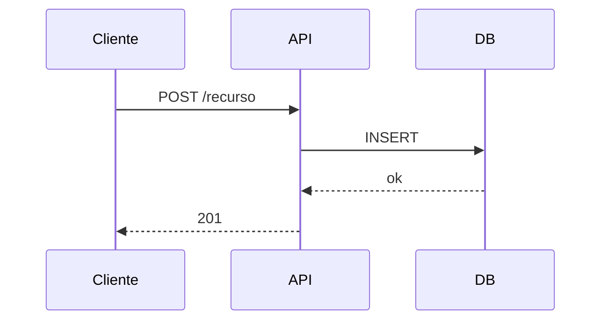

# Diagramas Mermaid para el resumen

Uso compartido por `pr-summary` (y opcionalmente `pr-review`). Un diagrama solo se genera **si reduce el esfuerzo de comprensión**; nunca se fuerza.

## Cuándo generar

| Forma del cambio | Diagrama | Motivo |
|---|---|---|
| Interacción entre componentes/capas a lo largo del tiempo | `sequenceDiagram` | **Default** de CodeRabbit. |
| Nuevos módulos/paquetes o cambios de dependencias | `flowchart LR` | Muestra el grafo. |
| Transiciones de estado | `stateDiagram-v2` | Muestra la máquina de estados. |
| Clases, interfaces, herencia | `classDiagram` | Muestra la estructura. |
| Esquema de datos y relaciones | `erDiagram` | Muestra el modelo. |

**No generar** si el diff es pequeño, local o lineal (rename, fix puntual, una dependencia suelta, cambio de config).

## Reglas

- Máximo ~15 nodos por diagrama; si hay más, divide o anida `subgraph`.
- Nombres de nodos **verbatim** del código; no renombrar módulos.
- No inventar nodos ni aristas: si la relación es desconocida, márcala `???`.
- El diagrama **acompaña** al walkthrough textual; no lo sustituye.
- Deriva del diff, no de la arquitectura ideal.

## Plantilla inline



## Render opcional (solo si el usuario lo pide y hay red)

Guarda el bloque a `.mmd` y renderiza; escribe en `/tmp/pr-summary/` para no ensuciar el repo:

```bash
mkdir -p /tmp/pr-summary
npx -p @mermaid-js/mermaid-cli mmdc -i /tmp/pr-summary/diagrama.mmd -o /tmp/pr-summary/diagrama.svg
```

`-t dark` (tema oscuro), `-b transparent` (PNG transparente). Si el render falla, deja el `.md` con el Mermaid inline y avísale.
